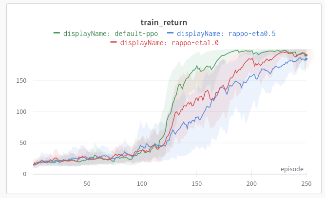
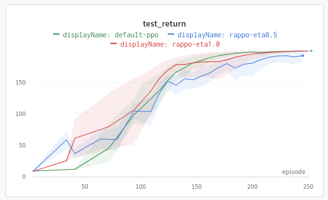

# Risk-Averse Policy Learning
Pytorch implementation of the Risk-Averse PPO (RA-PPO) from the paper [Robust Quadrupedal Locomotion via Risk-Averse Policy Learning](https://arxiv.org/pdf/2308.09405.pdf)

Currently only a discrete action space implementation!

# Performance CartPole-v0

